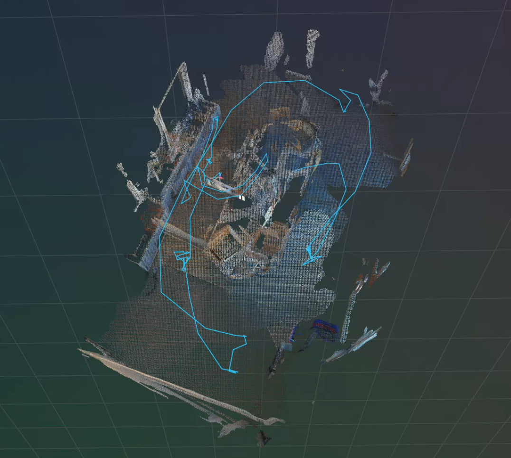
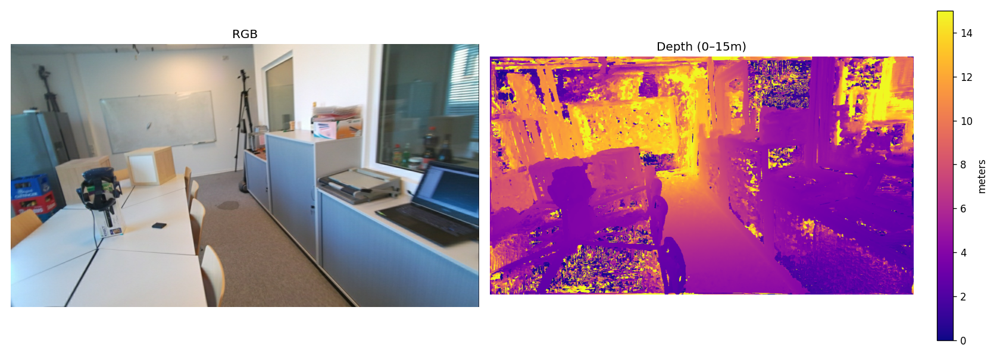

# Colmap-sfm-hamer

A full 3D reconstruction pipeline built on top of COLMAP, from raw distorted images to a dense point cloud with animated 3D hand meshes visualized live in [Rerun](https://rerun.io).



---

## Pipeline Overview

```
RGB frames (1280×720)
    │
    ▼
undistort_images.py     → rgb_undistorted/ + PINHOLE intrinsics
    │
    ▼
colmap_pipeline.py      → sparse/ (SfM: feature extraction → sequential matching → incremental mapping)
    │
    ▼
dense_pipeline.py       → dense/fused.ply (MVS: image_undistorter → patch_match_stereo → stereo fusion)
    │
    ▼
visualize_rerun.py      → Rerun 3D viewer (dense cloud +  camera trajectory)
    │
    ▼
hamer_rerun.py          → 3D hand meshes in world space overlaid on COLMAP scene
```

---


## Camera

- Resolution: **1280 × 720**
- Distortion model: `FULL_OPENCV` (rational_polynomial, 8 coefficients)
- After undistortion: `PINHOLE` `fx=638.73, fy=638.59, cx=642.25, cy=368.09`

---

## Key Results

### Depth Map Preview


Dense depth maps were computed per-frame by `patch_match_stereo` using geometric consistency across neighbouring views.

### Dense Point Cloud
The fused point cloud (`dense/fused.ply`) was built from depth-map fusion across all registered views via `stereo_fusion`. 

### HaMeR Hand Meshes
3D MANO hand meshes are predicted by [HaMeR](https://github.com/geopavlakos/hamer) on each frame and projected into world space using the COLMAP camera-from-world transform:

```
X_world = R^T @ (X_cam − t)
```

Each hand accumulates in the Rerun timeline, building up the full hand-motion trajectory across the sequence.

---


## Usage

```bash
# 1. Undistort raw frames
python src/undistort_images.py

# 2. Sparse SfM
python src/colmap_pipeline.py

# 3. Dense MVS
python src/dense_pipeline.py

# 4. Visualize in Rerun
python src/visualize_rerun.py

# 5. HaMeR hand reconstruction
python src/hamer_rerun.py
```
